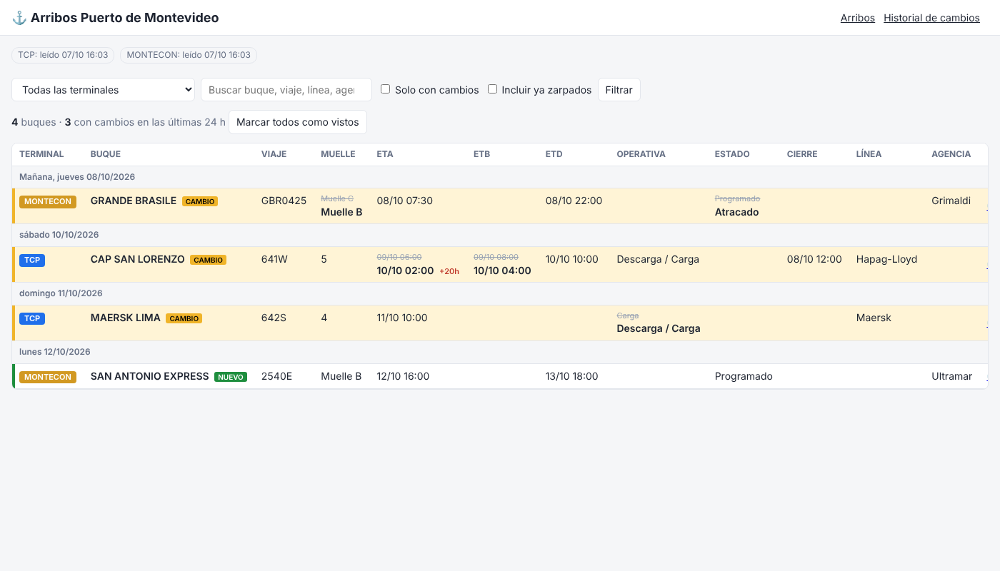

# Arribos Puerto de Montevideo

Sitio en PHP + MySQL que junta en una sola página las llegadas de buques que
publican las dos terminales (TCP y Montecon) y **destaca los cambios en la
operativa prevista** (ETA, ETB, ETD, muelle, operativa, estado, cierre).



## Qué hace

- Un proceso (`cron/actualizar.php`) lee cada 10 minutos las páginas de las terminales.
- Compara con lo guardado y registra cada cambio (valor anterior → valor nuevo).
- La página principal muestra todos los buques ordenados por ETA y agrupados por día:
  - Filas en **amarillo** con etiqueta **CAMBIO**: el dato modificado aparece en negrita con el valor anterior tachado.
  - Etiqueta **NUEVO** para los buques que aparecieron en las últimas 24 h.
  - Demora o adelanto respecto a la **primera ETA publicada** (por ejemplo, `+20h`).
  - Filtros por terminal, búsqueda (buque, viaje, línea o agencia), "solo con cambios" y "marcar como visto".
  - Indicador de la última lectura de cada terminal, en rojo si falló.
- `historial.php`: todos los cambios de los últimos días, o el historial completo de un buque.

## Instalación

1. Requisitos: PHP 8.1 o superior con las extensiones `pdo_mysql`, `curl`, `dom` y `mbstring`, y MySQL o MariaDB.
2. Crear la base de datos y cargar el esquema:
   ```sql
   CREATE DATABASE puerto CHARACTER SET utf8mb4 COLLATE utf8mb4_unicode_ci;
   CREATE USER 'puerto'@'localhost' IDENTIFIED BY 'una-clave';
   GRANT ALL ON puerto.* TO 'puerto'@'localhost';
   ```
   ```bash
   mysql -u puerto -p puerto < sql/schema.mysql.sql
   ```
3. `cp config.example.php config.php` y completar los datos de la base y **las URL
   de las páginas de arribos de cada terminal**.
4. Apuntar el servidor web a la carpeta `public/`. Solo esa carpeta debe quedar
   accesible desde internet.
5. Programar la lectura con cron:
   ```
   */10 * * * * php /ruta/a/Puerto/cron/actualizar.php >> /ruta/a/Puerto/data/cron.log 2>&1
   ```
   Para probar a mano: `php cron/actualizar.php` (o `php cron/actualizar.php TCP` para una sola terminal).

## Ajustar a las páginas de las terminales

Cada terminal se configura en `config.php`, en `terminales`. El lector `tabla_html`
busca en la página la tabla cuyos encabezados coinciden con los nombres de
`columnas`. No distingue mayúsculas ni tildes y acepta encabezados como "Cierre Documental"
para `cierre`. Si una terminal usa otro nombre de columna, se agrega a la lista
correspondiente.

Si una página carga los datos con JavaScript, o el lector no encuentra la tabla,
la lectura queda marcada en rojo en la página principal. En ese caso hay que
agregar un lector específico en `src/Lector.php`, por ejemplo si la terminal
publica un JSON, un Excel o un PDF.

Para no vaciar la lista por un error, una lectura que no devuelve buques no
modifica los datos guardados.

## Pruebas

```bash
php tests/prueba.php
```
Usa páginas de ejemplo (`tests/fixtures/`) y SQLite en memoria. No necesita internet ni MySQL.

Para probar el sitio completo sin MySQL, en `config.php` se puede poner `'driver' => 'sqlite'`.
